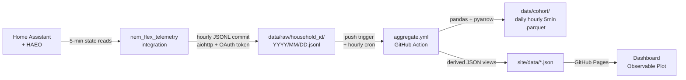

# NEM Flex Telemetry

**OpenNEM for the demand side. A community-built, open-data picture of household demand flexibility in the National Electricity Market.**

**Status: v0.2.0.** GitHub OAuth Device Flow, 13-field schema (v1.1 adds `price_export_seen`), HAEO entity auto-discovery.

## Live dashboard

**[purcell-lab.github.io/nem-flex-telemetry](https://purcell-lab.github.io/nem-flex-telemetry/)**

The dashboard renders the moment Pages deploys. Until the first household publishes telemetry, all five views show a synthetic 24-hour sample dataset and a banner makes the demo state explicit. Real data appears automatically once the first install starts pushing, the demo banner disappears, and the cohort-size + last-updated badges above start moving.

---

## Why this exists

AEMO's Integrating Price-Responsive Resources (IPRR) program asks four questions that no existing dataset answers:

1. How much flexible load exists in the NEM right now, at the distribution level?
2. Do households actually respond to price signals, and by how much?
3. What are the real envelope constraints (import/export limits) in each postcode?
4. What is the counterfactual cost of demand that was not deferred?

Distributed optimisers like [HAEO](https://github.com/hass-energy/haeo) already answer these questions inside each household. This project makes those answers visible at cohort scale, with open data and no central intermediary.

Frame: "IPRR Reporting Track, community data layer."

---

## The 13-field schema (v1.1)

Every 5-minute interval, each household pushes one record. Full specification: [SCHEMA.md](SCHEMA.md).

| Field | Type | Units | Description |
|---|---|---|---|
| `interval_start_utc` | string | ISO8601 | Interval start, UTC |
| `region` | string | NEM code | NSW1, QLD1, VIC1, SA1, TAS1 |
| `postcode_prefix` | string | 3 digits | First 3 digits of postcode only |
| `net_import_kw` | float | kW | Signed: positive = importing, negative = exporting |
| `price_signal_seen` | float | $/MWh | Buy price signal seen by the optimiser |
| `price_export_seen` | float | $/MWh | Export/sell price seen by the optimiser. Positive = FiT earned, negative = negative FiT event |
| `optimiser_setpoint_kw` | float | kW | Setpoint commanded by HAEO |
| `flex_available_up_kw` | float | kW | Headroom available to increase load |
| `flex_available_down_kw` | float | kW | Headroom available to decrease load or export |
| `storage_soc_pct` | float | % | Battery state of charge, 0-100 |
| `envelope_import_limit_kw` | float | kW | DNSP-derived import limit |
| `envelope_export_limit_kw` | float | kW | DNSP-derived export limit |
| `naive_baseline_kw` | float | kW | What consumption would have been without optimisation |

The `price_export_seen` field (added in schema v1.1) captures the buy/sell price asymmetry seen by the optimiser. As middle-of-day feed-in tariffs collapse or go negative, publishing both prices makes this visible at cohort scale for the first time.

---

## How to join

**Prerequisites:** Home Assistant running with [HAEO](https://github.com/hass-energy/haeo) configured.

### Step 1: Install via HACS, then click through GitHub Device Flow when prompted. No tokens to copy.

In HACS, add this repo as a custom Integration source: `https://github.com/purcell-lab/nem-flex-telemetry`. Install, restart HA, then go to Settings > Devices and Services > Add Integration > NEM Flex Telemetry. The integration will guide you through GitHub authorisation using Device Flow.

Full guide: [docs/INSTALL.md](docs/INSTALL.md)

---

## Privacy posture

- Postcode prefix (first 3 digits) only. No exact location. No NMI. No appliance-level data.
- Data is published under CC-BY-4.0. You retain no expectation of re-identification given the postcode prefix anonymisation.
- You can withdraw at any time by raising an issue to request data removal from historical cohort files.
- Security model: [docs/SECURITY.md](docs/SECURITY.md)

---

## Architecture

---

## Roadmap

| Version | Milestone |
|---|---|
| v0.1 | Single-household MVP: integration installs, pushes JSONL, dashboard renders |
| v0.2 | OAuth Device Flow, schema v1.1 (price_export_seen), HAEO entity auto-discovery |
| v0.3 | ARENA-grant-ready cohort of 100, automated IPRR-format reporting exports |
| v1.0 | IPRR-submission-ready cohort of 1000, full price-response curve with statistical confidence |

---

## Acknowledgements

- [HAEO](https://github.com/hass-energy/haeo) by the hass-energy team: the LP optimiser this integration reads.
- [EMHASS](https://github.com/davidusb-geek/emhass): complementary open-source energy management.
- [OpenElectricity](https://openelectricity.org.au/) (formerly OpenNEM): the generation-side open-data standard this project mirrors for demand.
- [Project Edith](https://www.ausgrid.com.au/-/media/Documents/1-PDF/Project-Edith-Insights-Report-Dec-2025.pdf): Ausgrid's locational DER trial, evidence base for envelope constraints.
- AEMO IPRR team: for the [HLIA framework](https://www.aemo.com.au/-/media/files/initiatives/integrating-price-responsive-resources-into-the-nem/iprr---hlia---v11-for-publication.pdf) and [Price Responsive Reporting Guidelines](https://www.aemo.com.au/-/media/files/electricity/nem/planning_and_forecasting/unscheduled-price-responsive-resources/final-determination-price-responsive-reporting-guidelines.pdf).

---

## References

- AEMO IPRR HLIA v1.1: https://www.aemo.com.au/-/media/files/initiatives/integrating-price-responsive-resources-into-the-nem/iprr---hlia---v11-for-publication.pdf
- AEMO Price Responsive Reporting Guidelines (Final): https://www.aemo.com.au/-/media/files/electricity/nem/planning_and_forecasting/unscheduled-price-responsive-resources/final-determination-price-responsive-reporting-guidelines.pdf
- Project Edith Stage 3 Insights Report (Dec 2025): https://www.ausgrid.com.au/-/media/Documents/1-PDF/Project-Edith-Insights-Report-Dec-2025.pdf
- OpenElectricity: https://openelectricity.org.au/
- HAEO: https://github.com/hass-energy/haeo

---

Code: MIT. Data: CC-BY-4.0. See [LICENSE-CODE](LICENSE-CODE) and [LICENSE-DATA](LICENSE-DATA).
